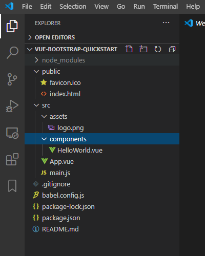

# Set up the project
## Create a new VueJS project
Open a command line window (terminal on Mac and Command Prompt on Windows), go to the directory you want to create the project in (for me that's `cd \Data\Projects\VSCode\`) and run the following command: `vue ui`. This will open a browser windows. Click on Create Project, then Create a new project here. Enter a name, select npm as package manager and click on Next. On the next page select Default Present and click on Create Project.
Let's look at what was created \

* [`package.json`](../package.json) This is the central configuration file for node and npm. It contains packages that are being used and run/build instructions. 
* [`package-lock.json`](../package-lock.json) Is a file maintained by npm that contains the concrete version of packages that are being used, do not change that file manually. 
* [`babel.config.js`](../babel.config.js) The configuration file for the Babel compiler
* [`.gitignore`](../gitignore) Configuration file for git to define what files are excluded from version control
* `public` This folder contains the static files that client can load from the server.
  * [`index.html`](../public/index.html) The index file is the default file, that gets shown, when no specific page gets requested. This is the start point for your Single Page Application.
  * `favicon.ico` The default icon for the app.
* `src` The root folder for all source code files
  * `assets` Static resource files
  * [`App.vue`](../src/App.vue) Defines the app component that is referred by `index.html`. This is the starting point for all you VueJS code.
  * `components` A folder containing VueJS components, there are no conventions how you structure your VueJS code, but it is recommended to have a suitable directory structure, so you easily find the code you are looking for.
  * [`HelloWorld.vue`](../src/components/HelloWorld.vue) Example Hello World component.

## Start up Visual Studio Code (or short VSCode)
Start Visual Studio Code. Once it's started click on File -> Open Folder and select the folder the project was created in.

## Start up the local server for the first time
Open a Terminal in VSCode and enter the following command `npm run serve`. The server will start on port 8080 on localhost, which is your computer. \
Open a browser and enter `http://localhost:8080/` in the address line and you will see the Hello World Vue app.